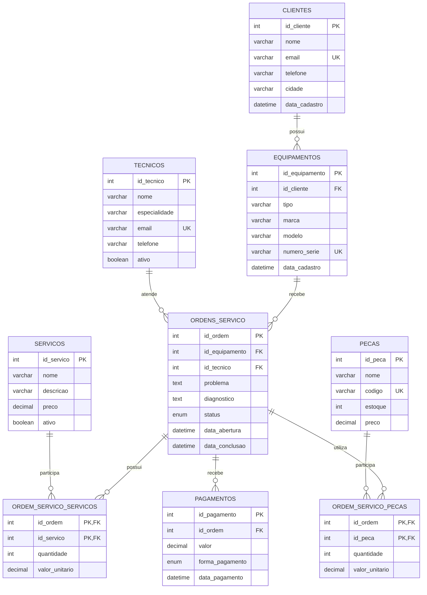

# TechFix — Sistema de Gestão de Assistência Técnica

Projeto de banco de dados relacional desenvolvido em **MySQL 8** para simular o funcionamento de uma pequena assistência técnica de computadores e smartphones.

O projeto foi criado para praticar e demonstrar conhecimentos de **modelagem relacional, criação de tabelas, chaves primárias e estrangeiras, relacionamentos 1:N e N:N, consultas SQL, JOINs, funções de agregação, GROUP BY, HAVING, CASE, CTEs e boas práticas de organização de banco de dados**.

## Objetivo

A TechFix precisa controlar clientes, equipamentos, técnicos, ordens de serviço, serviços realizados, peças utilizadas e pagamentos.

Com o banco de dados é possível, por exemplo:

- cadastrar clientes;
- cadastrar técnicos e suas especialidades;
- registrar os equipamentos de cada cliente;
- abrir e acompanhar ordens de serviço;
- relacionar vários serviços a uma ordem;
- registrar peças utilizadas em cada manutenção;
- controlar pagamentos;
- consultar o histórico de atendimentos;
- descobrir quantas ordens cada técnico possui;
- calcular faturamento por serviço;
- localizar ordens sem pagamento;
- calcular o valor total de uma ordem.

## Tecnologias

- **MySQL 8+**
- SQL
- Modelo relacional
- CTE (`WITH`)
- Chaves primárias e estrangeiras
- Constraints e integridade referencial

## Estrutura do projeto

```text
techfix-database/
│
├── README.md
│
├── database/
│   ├── 01_create_database.sql
│   ├── 02_create_tables.sql
│   ├── 03_insert_data.sql
│   └── 04_queries.sql
│
├── docs/
│   └── modelo-relacional.md
│
└── LICENSE
```

## Modelo do banco



## Relacionamentos

### Clientes → Equipamentos

Um cliente pode possuir vários equipamentos, mas cada equipamento pertence a um cliente.

**Relacionamento: 1:N**

### Equipamentos → Ordens de Serviço

Um equipamento pode possuir várias ordens de serviço ao longo do tempo.

**Relacionamento: 1:N**

### Técnicos → Ordens de Serviço

Um técnico pode ser responsável por várias ordens. Uma ordem pode estar sem técnico enquanto ainda aguarda atendimento.

**Relacionamento: 1:N**

### Ordens → Serviços

Uma ordem pode possuir vários serviços e um mesmo serviço pode ser utilizado em várias ordens.

**Relacionamento: N:N**, implementado pela tabela `ordem_servico_servicos`.

### Ordens → Peças

Uma ordem pode utilizar várias peças e uma peça pode ser utilizada em várias ordens.

**Relacionamento: N:N**, implementado pela tabela `ordem_servico_pecas`.

### Ordens → Pagamentos

Uma ordem pode ter nenhum, um ou vários pagamentos.

**Relacionamento: 1:N**

## Tabelas

| Tabela | Função |
|---|---|
| `clientes` | Dados dos clientes |
| `tecnicos` | Técnicos da assistência |
| `equipamentos` | Equipamentos cadastrados |
| `ordens_servico` | Atendimentos/manutenções |
| `servicos` | Catálogo de serviços |
| `ordem_servico_servicos` | Serviços vinculados às ordens |
| `pecas` | Peças e estoque |
| `ordem_servico_pecas` | Peças utilizadas nas ordens |
| `pagamentos` | Pagamentos realizados |

## Como executar

### 1. Criar o banco

Execute:

```sql
SOURCE database/01_create_database.sql;
```

Ou abra o arquivo no MySQL Workbench e execute o conteúdo.

### 2. Criar as tabelas

Execute:

```sql
SOURCE database/02_create_tables.sql;
```

### 3. Inserir os dados de exemplo

Execute:

```sql
SOURCE database/03_insert_data.sql;
```

### 4. Testar as consultas

Execute:

```sql
SOURCE database/04_queries.sql;
```

## Principais conceitos demonstrados

### SELECT

Usado para consultar informações armazenadas nas tabelas.

### WHERE

Filtra registros de acordo com uma condição.

### ORDER BY

Ordena os resultados de uma consulta.

### LIKE

Permite pesquisar padrões em textos.

### IN

Permite verificar se um valor pertence a uma lista.

### BETWEEN

Filtra valores dentro de um intervalo.

### INNER JOIN

Relaciona tabelas e retorna apenas registros que possuem correspondência.

### LEFT JOIN

Mantém todos os registros da tabela da esquerda, mesmo quando não existe correspondência na tabela da direita.

### GROUP BY

Agrupa registros para permitir cálculos por categoria ou entidade.

### HAVING

Filtra os grupos produzidos pelo `GROUP BY`.

### COUNT

Conta registros.

### SUM

Calcula uma soma.

### AVG

Calcula uma média.

### MAX e MIN

Encontram o maior e o menor valor.

### CASE

Permite criar classificações condicionais dentro da consulta.

### COALESCE

Substitui valores `NULL` por outro valor, como `0`.

### CTE (`WITH`)

Cria resultados temporários nomeados dentro de uma consulta. No projeto, as CTEs são usadas para calcular serviços e peças separadamente antes de obter o valor total da ordem.

## Um detalhe importante sobre JOINs e agregações

Ao calcular o valor total de uma ordem, não é seguro simplesmente fazer `JOIN` simultâneo entre serviços e peças e depois usar `SUM()` nas duas tabelas. Como ambas são relações 1:N com a ordem, as linhas podem ser multiplicadas e o valor pode ficar incorreto.

Por isso, a consulta 25 primeiro calcula o total de serviços e o total de peças separadamente e somente depois junta os resultados. Essa abordagem evita a duplicação causada pelo relacionamento entre duas tabelas filhas.

## Exemplos de perguntas que o banco consegue responder

```sql
-- Quantas ordens existem?
SELECT COUNT(*) FROM ordens_servico;
```

```sql
-- Quantas ordens existem por status?
SELECT status, COUNT(*)
FROM ordens_servico
GROUP BY status;
```

```sql
-- Quais técnicos possuem pelo menos 3 ordens?
SELECT t.nome, COUNT(os.id_ordem) AS quantidade
FROM tecnicos t
JOIN ordens_servico os ON t.id_tecnico = os.id_tecnico
GROUP BY t.id_tecnico, t.nome
HAVING COUNT(os.id_ordem) >= 3;
```

```sql
-- Quais ordens ainda não possuem pagamento?
SELECT os.id_ordem
FROM ordens_servico os
LEFT JOIN pagamentos p ON os.id_ordem = p.id_ordem
WHERE p.id_pagamento IS NULL;
```

## Possíveis melhorias futuras

O projeto pode ser expandido com:

- controle de usuários e login;
- histórico de alterações de status;
- controle automático de baixa de estoque;
- orçamento antes da aprovação do serviço;
- emissão de nota fiscal;
- garantia dos serviços realizados;
- relatórios financeiros;
- dashboard utilizando Power BI ou outra ferramenta;
- API utilizando Flask, FastAPI ou Node.js;
- aplicação web para os funcionários da assistência.

## Objetivo para portfólio

Este projeto pode ser utilizado como demonstração prática de conhecimento em banco de dados durante processos seletivos, especialmente para mostrar domínio de:

- modelagem relacional;
- SQL;
- normalização básica;
- integridade referencial;
- relacionamentos entre tabelas;
- consultas com múltiplos `JOINs`;
- agregações;
- análise de dados através de consultas SQL.

## Autor

**Romário Júnior Xavier Prates**

Projeto desenvolvido para estudos e demonstração de conhecimentos em banco de dados.
