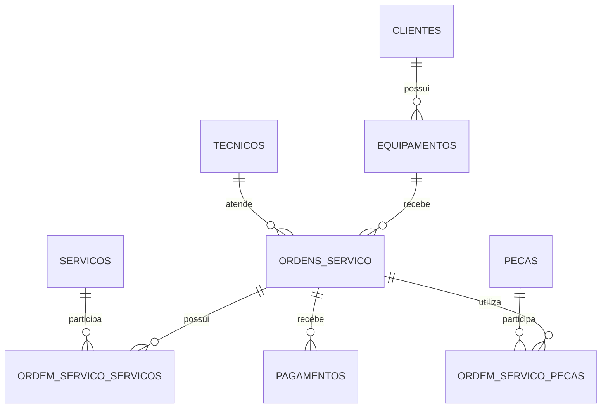

# Modelo Relacional — TechFix

## Resumo dos relacionamentos

- Clientes 1:N Equipamentos
- Equipamentos 1:N Ordens de Serviço
- Técnicos 1:N Ordens de Serviço
- Ordens de Serviço N:N Serviços, através de `ordem_servico_servicos`
- Ordens de Serviço N:N Peças, através de `ordem_servico_pecas`
- Ordens de Serviço 1:N Pagamentos
